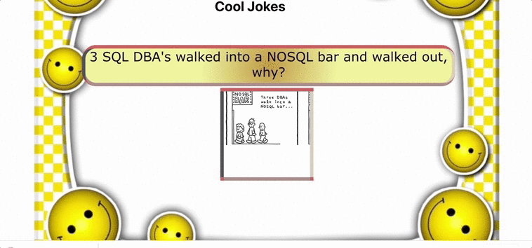

## Jokes App - an app that displays programming jokes

## Table of contents

- [Preface](#Preface)
- [How to start](#How-to-start)
- [Technologies used for this project](#Technologies-used-for-this-project)
- [Contributors](#Contributors)

## Preface

This joke application, randomly displays jokes releated to programming, one at a time. The punchline for the joke gets displayed after 3 seconds. The user can move on to the next joke through the 'Next Joke' button.

Here's a little demo...

## How to start

1. Clone the git repository into a new directory on your computer: `git clone git@github.com:LavanyaJay/joke-client.git`
2. Run `npm install` on your terminal to install all the dependendencies
3. Run `npm start` to get a preview of the front-end

## Technologies used for this project

1. React with `create-react-app`
2. `mobx` and `react-mobx` to set up MobX store and dispatch actions
3. `fetch` to fetch data from the database

## Contributor

- Lavanya Jayapalan | [Github](https://github.com/LavanyaJay)
